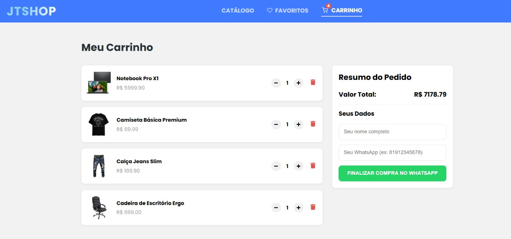
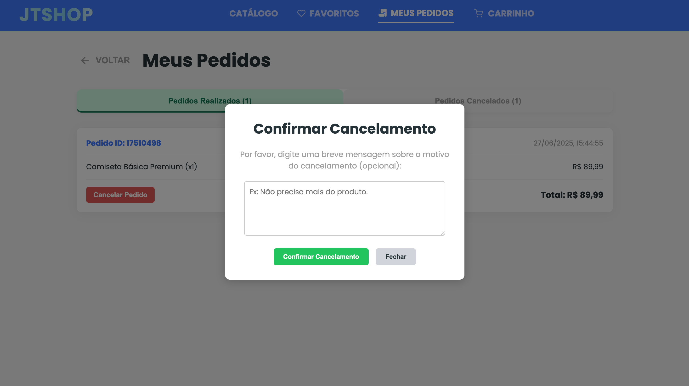

# JTSHOP - Catálogo de Produtos Interativo

Um projeto de frontend completo e moderno, desenvolvido com React e TypeScript, que simula um catálogo de produtos com funcionalidades interativas, gerenciamento de favoritos, um fluxo de carrinho de compras com ajuste de quantidade e uma integração de checkout via WhatsApp.

Este projeto foi desenvolvido como trabalho final para o módulo de Front-End, demonstrando a aplicação de tecnologias e boas práticas de desenvolvimento web.

## Colaboradores

Este projeto foi desenvolvido em dupla por:

- **João Victtor Paulo**
- **Thamyres Cordeiro**

## Funcionalidades Principais

O JTSHOP oferece uma experiência de usuário rica com as seguintes funcionalidades:

- **Página de Início (Landing Page):** Uma tela de boas-vindas intuitiva com chamada para o catálogo de produtos.
- **Catálogo de Produtos Dinâmico:**
  - Listagem de produtos com cards visualmente atraentes.
  - Filtro de produtos por nome e por categoria (seleção via dropdown).
- **Página de Detalhes do Produto:**
  - Visualização aprofundada de cada produto, com descrição e preço.
  - Botão "Voltar" para navegação fluida.
- **Gerenciamento de Favoritos:**
  - Usuários podem adicionar e remover produtos da sua lista de favoritos.
  - Persistência dos favoritos no Local Storage do navegador.
  - Visualização de todos os itens favoritos em uma página dedicada.
- **Sistema de Carrinho de Compras Completo:**
  - Adição rápida de produtos ao carrinho diretamente da listagem de produtos.
  - Notificação visual de "Adicionado ao carrinho!" (popup/toast).
  - Página de carrinho com listagem detalhada dos produtos.
  - Controle de quantidade para cada item no carrinho (incrementar/decrementar).
  - Remoção de itens específicos do carrinho.
  - Cálculo do valor total do pedido.
  - Persistência dos itens do carrinho no Local Storage.
  - Botão "Voltar" para navegação.
- **Checkout Simplificado com WhatsApp:**
  - Formulário para o cliente informar nome e telefone.
  - Botão "FINALIZAR COMPRA NO WHATSAPP" que gera um link direto para o WhatsApp com o resumo completo do pedido e dados do cliente.
- **Histórico de Pedidos:**
  - Visualização de todos os pedidos realizados, salvos no Local Storage.
  - Organização interativa por abas: "Pedidos Realizados" e "Pedidos Cancelados".
  - Botão "Voltar" para navegação.
- **Solicitação de Cancelamento de Pedido:**
  - Opção para cancelar um pedido diretamente da lista de "Pedidos Realizados".
  - Prompt para o usuário digitar uma mensagem opcional de cancelamento.
  - Envio de mensagem via WhatsApp para o lojista, informando o cancelamento do pedido (com ID e itens), e a mensagem do cliente.
  - Atualização do status do pedido para "Cancelado" e movimentação para a aba "Pedidos Cancelados".

## Tecnologias Utilizadas

Este projeto foi construído utilizando as seguintes tecnologias e conceitos:

- **Frontend:**
  - **React:** Biblioteca JavaScript para construção da interface de usuário.
  - **TypeScript:** Superset do JavaScript que adiciona tipagem estática, aumentando a robustez e manutenibilidade do código.
  - **CSS Modules:** Para escopo e modularização dos estilos CSS, evitando conflitos globais.
  - **React Router DOM:** Para gerenciamento de rotas e navegação entre as páginas da aplicação.
  - **React Icons:** Biblioteca de ícones (carrinho, coração, menu, etc.).
  - **Context API:** Para gerenciamento de estado global (favoritos e carrinho), evitando o "prop drilling".
  - **Hooks Customizados:** Para abstrair lógicas de contexto e outras funcionalidades reutilizáveis.
  - **Local Storage API:** Para persistência de dados no lado do cliente (favoritos, carrinho e histórico de pedidos).
- **Ferramentas:**
  - **Vite:** Ferramenta de build rápida e leve para projetos frontend.
  - **Git:** Sistema de controle de versão.
  - **GitHub:** Plataforma para hospedagem do código e colaboração.

## Boas Práticas e Diferenciais

O projeto foi desenvolvido com foco em:

- **Código Limpo e Componentização:** Estrutura de componentes modular e reutilizável, facilitando a manutenção.
- **Design Responsivo (Mobile-First):** Layouts adaptáveis a diferentes tamanhos de tela (desktops, tablets e smartphones), garantindo uma excelente experiência de usuário em qualquer dispositivo.
- **Estilização Profissional:** Interface visualmente agradável, com paleta de cores coesa, tipografia moderna (Poppins via Google Fonts) e efeitos de sombra/elevação para profundidade.
- **Animações e UX:**
  - Animações de gradiente dinâmicas na logo "JTSHOP" e no botão principal da Landing Page.
  - Animação de feedback ao adicionar produtos ao carrinho (popup).
  - Efeitos de hover interativos nos cards de produtos.
  - Transições suaves de abas e modais na página de Pedidos.
- **Gerenciamento de Estado Eficiente:** Uso estratégico da Context API para estados que precisam ser acessíveis globalmente (carrinho, favoritos, histórico de pedidos).
- **Persistência de Dados no Cliente:** Melhoria significativa na experiência do usuário ao manter favoritos, itens do carrinho e histórico de pedidos após recarregar a página.
- **Integração do Mundo Real:** A funcionalidade de checkout e cancelamento de pedidos via WhatsApp simula uma aplicação prática de negócio.

## Capturas de Tela / Demonstração

Aqui estão algumas capturas de tela que demonstram as principais funcionalidades e a interface do JTSHOP.

#### **1. Página Inicial **

Uma recepção moderna e interativa, convidando o usuário a explorar o catálogo.

#### **2. Catálogo de Produtos **

Exibição organizada dos produtos em formato de grade, com filtros de busca por nome e categoria.

#### **3. Página de Detalhes do Produto **

Visão detalhada de um produto individual, incluindo descrição e preço.

#### **4. Meu Carrinho **

Acompanhamento dos itens adicionados, com controle de quantidade e resumo do pedido.

#### **5. Meus Favoritos **

Lista de produtos marcados como favoritos pelo usuário.

#### **6. Histórico de Pedidos **

Visualização de pedidos realizados e cancelados em abas interativas, com opção de cancelamento e detalhes do pedido.

  
  

#### **7. Modal de Confirmação de Cancelamento **

Uma janela modal para o usuário confirmar o cancelamento de um pedido.

#### **8. Design Responsivo (Mobile) **

Exemplo de como a aplicação se adapta para telas menores, incluindo o menu "hambúrguer" no cabeçalho.

  
  

---
